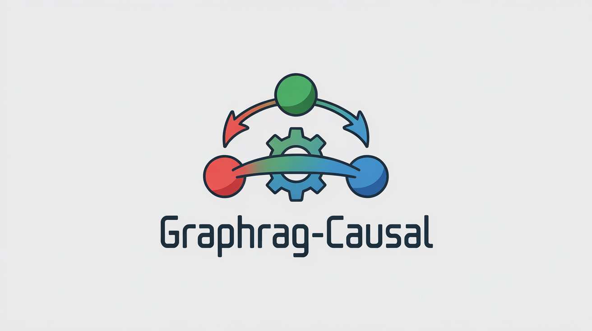
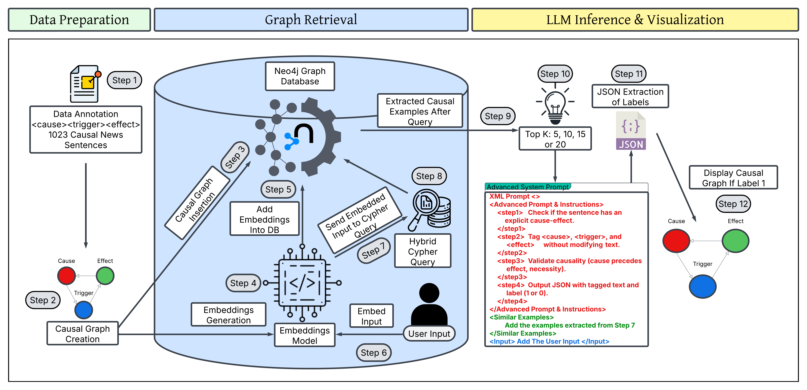

# GraphRAG-Causal



A graph-based Retrieval Augmented Generation (RAG) system for causal inference and visualization.

## Overview

GraphRAG-Causal combines graph database technologies with Large Language Models (LLMs) to identify and visualize causal relationships in text. The system processes annotated causal sentences, stores them in a Neo4j graph database, and uses embeddings-based retrieval to find relevant causal examples for improved LLM inference.

## Architecture

The system is composed of three main components:

### 1. Data Preparation
- Annotated dataset of 1,023 causal news sentences with cause, trigger, and effect labels
- Creation of causal graphs representing these relationships

### 2. Graph Retrieval
- Neo4j graph database for storing causal relationships
- Embeddings generation and insertion
- Hybrid Cypher queries using both semantic similarity and graph structure
- User input processing and embedding

### 3. LLM Inference & Visualization
- Retrieval of Top-K (5, 10, 15, or 20) most relevant examples
- Advanced system prompting for LLMs
- JSON extraction of causal labels
- Visual representation of causal graphs

## Repository Structure

```
GraphRAG-Causal/
├── data/
│   ├── Causal_dataset.csv
│   └── test_data.csv
├── notebooks/
│   ├── 1-GraphDB-Data-Insertion.ipynb
│   ├── 2-GraphDB-Data-Embeddings-Addition.ipynb
│   ├── 3-Main-GraphRAG-Implementation-deepseek.ipynb
│   ├── 4-Testing-Deepseek-25-30-40-50-Examples.ipynb
│   └── 5-Testing-Llama-4-Maverick-25-30-40-50-Examples.ipynb
├── predictions/
│   ├── Various test prediction files for both deepseek and maverick models
│   └── Results from different parameter configurations and iterations
├── GUI/
│   └── GUI.py
├── docs/
│   ├── GraphRAG_Causal.pdf
│   └── Other documentation files
└── requirements.txt
```

## Installation & Setup

1. Clone the repository:
```bash
git clone https://github.com/Ahaque-AI/GraphRAG-Causal.git
cd GraphRAG-Causal
```

2. Install dependencies:
```bash
pip install -r requirements.txt
```

3. Set up Neo4j:
   - Install Neo4j Desktop or use Neo4j Aura cloud service
   - Create a new database and set password
   - Update connection settings in notebooks and GUI

## Usage

### Running the Notebooks
The notebooks should be executed in numerical order:
1. First run data insertion notebook
2. Then add embeddings
3. Execute main implementation
4. Test with different models and parameters

### Using the GUI
Launch the GUI application to interactively query the system:
```bash
python GUI/GUI.py
```

## Models Supported

The system has been tested with:
- Deepseek distill llama 70b (various parameter settings)
- Llama-4 and Maverick models

## Contributors

- Ahaque-AI
